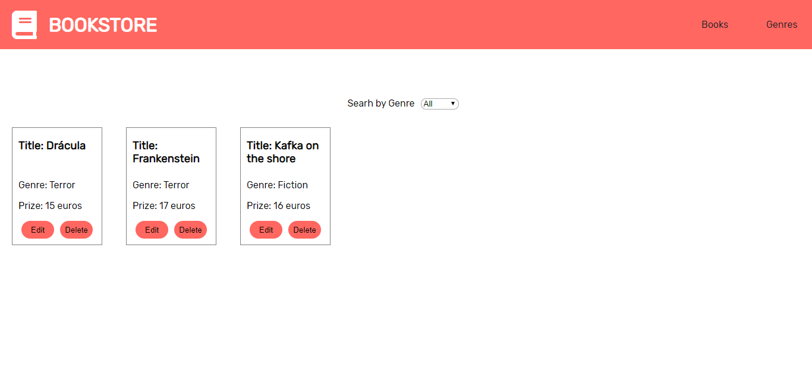
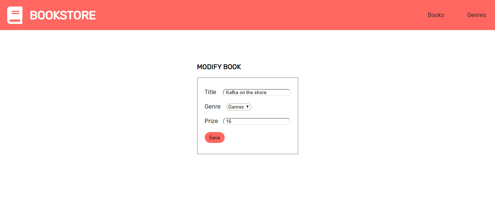
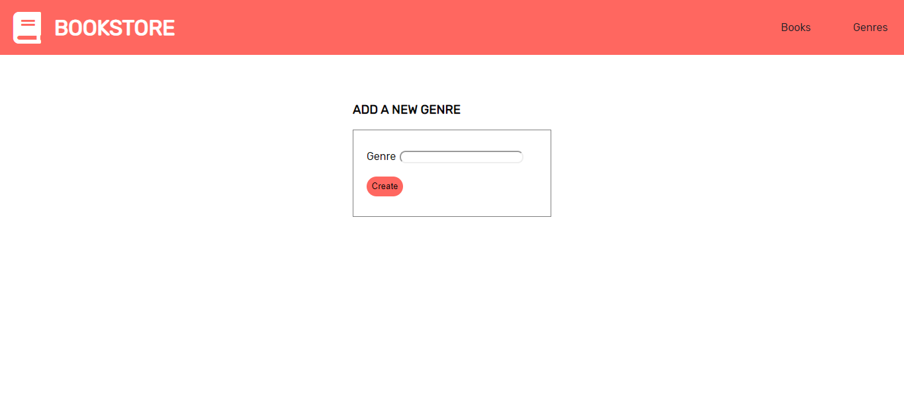

# BEEZY-FRONT-END-TEST BOOKSTORE CATALOG

## Link o enlaces
[Web demo](http://bezzy-bookstore-catalog.surge.sh/#/)

* Front-end app for a bookstore. To have a catalog of books. Where you can create, delete and modify books and genres.

# PROJECT DETAILS

* Frontend in React/Javascript
* Styles CSS with SASS
* Responsive
* Logic tested with mocha
* Simulated delay of one second as an asynchronous call.
* Compatible with Chrome and IE11

# PROJECT STRUCTURE

- app
    - public
    - src
        - components
        - containers
        - data
        - logic
        - utils

# TO START

* Clone the repo
* Install the dependencies
* "yarn start" to start the project
* "yarn test" to launch test

## SCREENSHOTS

### SEARCH BOOKS IN THE STORE

## EDIT BOOKS

## ADD NEW GENRES TO THE STORE

